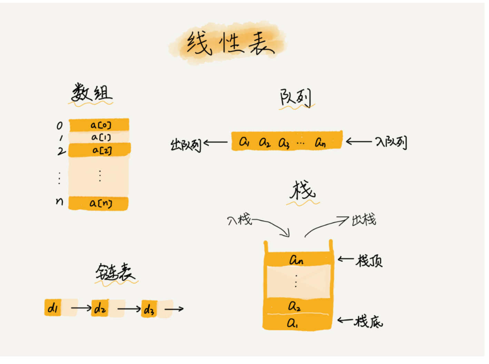
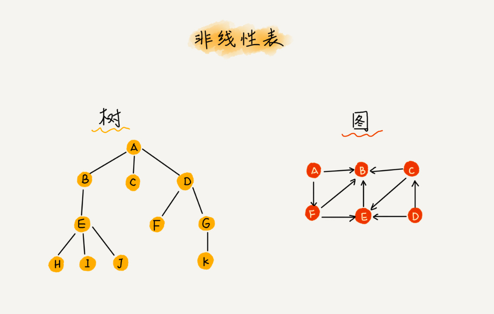
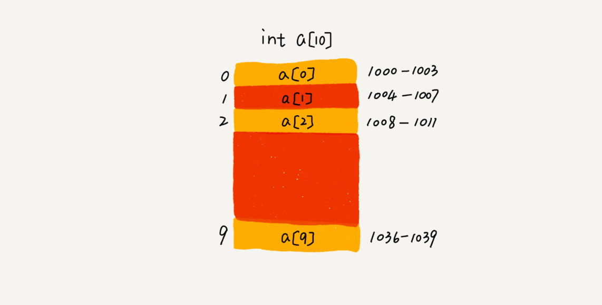

# 数组(Array)
## 数组概念
数组（Array）是一种线性表数据结构。它用一组连续的内存空间，来存储一组具有相同类型的数据。

1、线性表（Linear List）。顾名思义，线性表就是数据排成像一条线一样的结构。
每个线性表上的数据最多只有前和后两个方向。其实除了数组，链表、队列、栈等也是线性表结构。

而与它相对立的概念是非线性表，比如二叉树、堆、图等。之所以叫非线性，是因为，在非线性表中，数据之间并不是简单的前后关系。

2、连续的内存空间和相同类型的数据。正是因为这两个限制，它才有了一个堪称“杀手锏”的特性：“随机访问”。
但有利就有弊，这两个限制也让数组的很多操作变得非常低效，比如要想在数组中删除、插入一个数据，为了保证连续性，
就需要做大量的数据搬移工作。

## 数组和链表性能
这里我要特别纠正一个“错误”。数组和链表的区别，很多人都回答说，“链表适合插入、删除，时间复杂度 O(1)；数组适合查找，
查找时间复杂度为 O(1)”。
实际上，这种表述是不准确的。数组是适合查找操作，但是查找的时间复杂度并不为 O(1)。即便是排好序的数组，
你用二分查找，时间复杂度也是 O(logn)。所以，正确的表述应该是，数组支持随机访问，根据下标随机访问的时间复杂度为 O(1)。

低效的“插入”和“删除”
数组因为是连续的内存空间，所以在插入和删除时需要移动数据(如果是在数组尾部插入和删除时则不需要移动数据)
在数组头部插入或删除数据则时间复杂度为为O(n) 在数组尾部插入或删除数据则时间复杂度为O(1)

事先指定数据大小可以省掉很多次内存申请和数据搬移的操作

## ArrayList
ArrayList 最大的优势就是可以将很多数组操作的细节封装起来。
比如前面提到的数组插入、删除数据时需要搬移其他数据等。另外，它还有一个优势，就是支持动态扩容。

作为高级语言编程者，是不是数组就无用武之地了呢？当然不是，有些时候，用数组会更合适些

1.Java ArrayList 无法存储基本类型，比如 int、long，需要封装为 Integer、Long 类，
而 Autoboxing、Unboxing 则有一定的性能消耗，所以如果特别关注性能，或者希望使用基本类型，就可以选用数组。

2. 如果数据大小事先已知，并且对数据的操作非常简单，用不到 ArrayList 提供的大部分方法，也可以直接使用数组。

3. 还有一个是我个人的喜好，当要表示多维数组时，用数组往往会更加直观。比如 Object[][] array；
4. 而用容器的话则需要这样定义：ArrayList<ArrayList > array。
   对于业务开发，直接使用容器就足够了，省时省力。毕竟损耗一丢丢性能，
完全不会影响到系统整体的性能。但如果你是做一些非常底层的开发，比如开发网络框架，
性能的优化需要做到极致，这个时候数组就会优于容器，成为首选。

## 问题
1、为什么大多数编程语言中，数组要从 0 开始编号，而不是从 1 开始呢？

从数组存储的内存模型上来看，“下标”最确切的定义应该是“偏移（offset）”。前面也讲到，
如果用 a 来表示数组的首地址，a[0] 就是偏移为 0 的位置，也就是首地址，
a[k] 就表示偏移 k 个 type_size 的位置，所以计算 a[k] 的内存地址只需要用这个公式：

a[k]_address = base_address + k * type_size

但是，如果数组从 1 开始计数，那我们计算数组元素 a[k] 的内存地址就会变为：

a[k]_address = base_address + (k-1)*type_size
对比两个公式，我们不难发现，从 1 开始编号，每次随机访问数组元素都多了一次减法运算，对于 CPU 来说，就是多了一次减法指令。

2、为保证内存连续性，需要搬移数据，不让中间就好出现空洞，内存就不连续了，
实际上，在某些特殊场景下，我们并不一定非得追求数组中数据的连续性。如果我们将多次删除操作集中在一起执行，
删除的效率是不是会提高很多呢？

标记清除

ArrayList