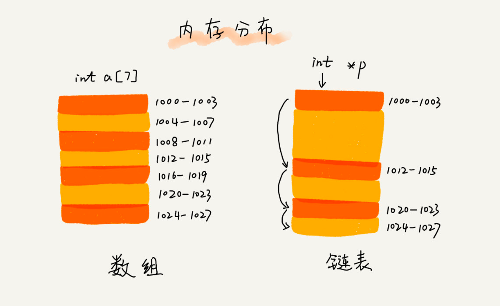
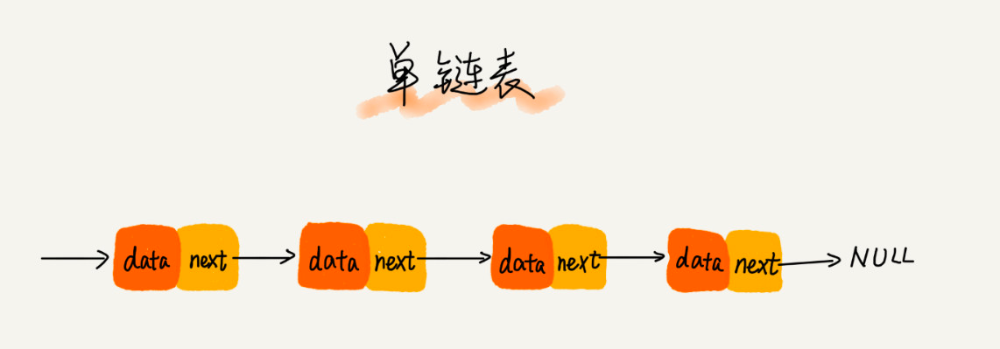
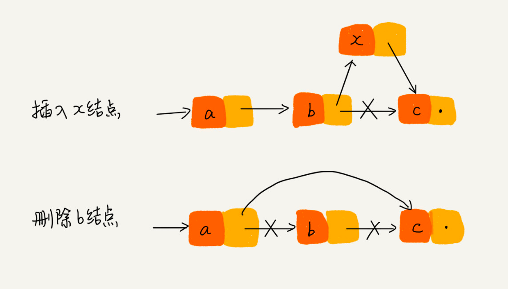
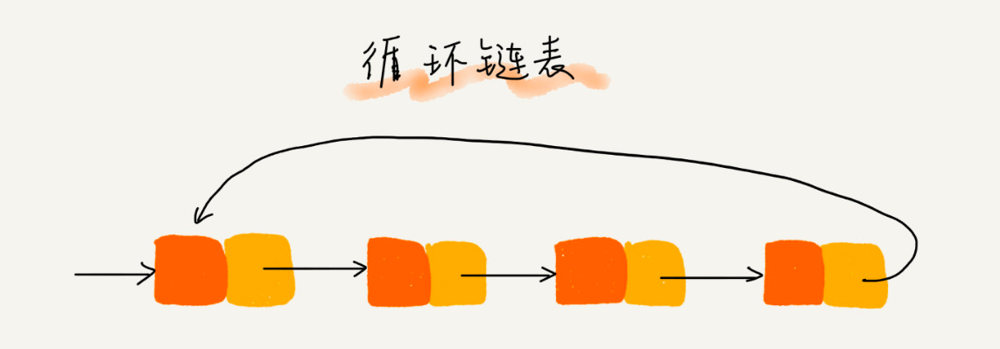
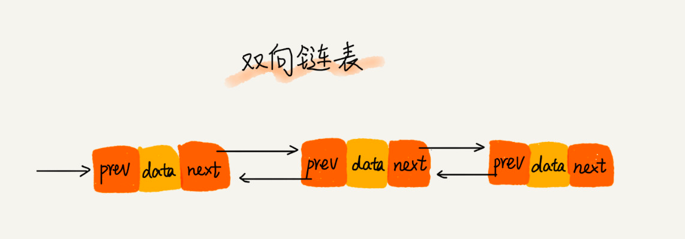
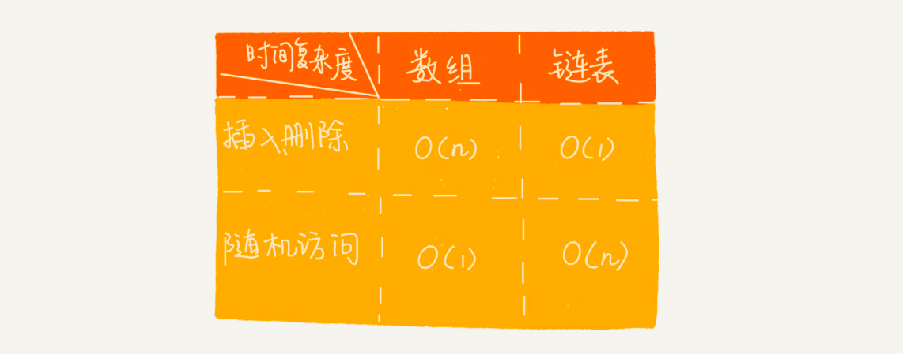

# 链表(Linked)

利用链表实现LRU缓存淘汰算法
先进先出策略 FIFO（First In，First Out）、
最少使用策略 LFU（Least Frequently Used）、
最近最少使用策略 LRU（Least Recently Used）。

数组需要连续的内存空间，链表则通过"指针"将一组零散的内存块串联起来使用

### 单链表

把第一个结点叫作头结点，把最后一个结点叫作尾结点。其中，头结点用来记录链表的基地址。 有了它，我们就可以遍历得到整条链表。
而尾结点特殊的地方是：指针不是指向下一个结点，而是指向一个空地址 NULL， 表示这是链表上最后一个结点。

在进行数组的插入、删除操作时，为了保持内存数据的连续性，需要做大量的数据搬移，所以时间复杂度是 O(n)。
而在链表中插入或者删除一个数据，我们并不需要为了保持内存的连续性而搬移结点，因为链表的存储空间本身就不是连续的。
所以，在链表中插入和删除一个数据是非常快速的。

链表要想随机访问第 k 个元素，就没有数组那么高效了。因为链表中的数据并非连续存储的，所以无法像数组那样， 根据首地址和下标，
通过寻址公式就能直接计算出对应的内存地址，而是需要根据指针一个结点一个结点地依次遍历，直到找到相应的结点。需要O(n)时间复杂度

### 循环链表
循环链表是一种特殊的单链表。它跟单链表唯一的区别就在尾结点。单链表的尾结点指针指向空地址， 表示这就是最后的结点了。
而循环链表的尾结点指针是指向链表的头结点。 它像一个环一样首尾相连，所以叫作“循环”链表。

和单链表相比，循环链表的优点是从链尾到链头比较方便。当要处理的数据具有环型结构特点时，就特别适合采用循环链表。

约瑟夫问题可以使用单链表解决，但是使用循环链表代码就好简洁的多

### 双向链表

空间换时间的设计思想。当内存空间充足的时候，如果我们更加追求代码的执行速度，我们就可以选择空间复杂度相对较高、但时间复杂度相对很低的算法或者数据结构。
相反，如果内存比较紧缺，比如代码跑在手机或者单片机上，这个时候，就要反过来用时间换空间的设计思路

### 链表 VS 数组性能

不过，数组和链表的对比，并不能局限于时间复杂度。而且，在实际的软件开发中，
不能仅仅利用复杂度分析就决定使用哪个数据结构来存储数据。

数组简单易用，在实现上使用的是连续的内存空间，可以借助 CPU 的缓存机制，预读数组中的数据，所以访问效率更高。
而链表在内存中并不是连续存储，所以对 CPU 缓存不友好，没办法有效预读。

数组的缺点是大小固定，一经声明就要占用整块连续内存空间。如果声明的数组过大，系统可能没有足够的连续内存空间分配给它，
导致“内存不足（out of memory）”。如果声明的数组过小，则可能出现不够用的情况。这时只能再申请一个更大的内存空间，
把原数组拷贝进去，非常费时。链表本身没有大小的限制，天然地支持动态扩容，我觉得这也是它与数组最大的区别。

如果你的代码对内存的使用非常苛刻，那数组就更适合你。因为链表中的每个结点都需要消耗额外的存储空间去存储一份指向下一个结点的指针，
所以内存消耗会翻倍。而且，对链表进行频繁的插入、删除操作，还会导致频繁的内存申请和释放，容易造成内存碎片，
如果是 Java 语言，就有可能会导致频繁的 GC（Garbage Collection，垃圾回收）。

LinkedList LinkedHashMap

### 练习
* 单链表反转
* 链表中环的检测
* 两个有序的链表合并
* 删除链表倒数第 n 个结点
* 求链表的中间结点