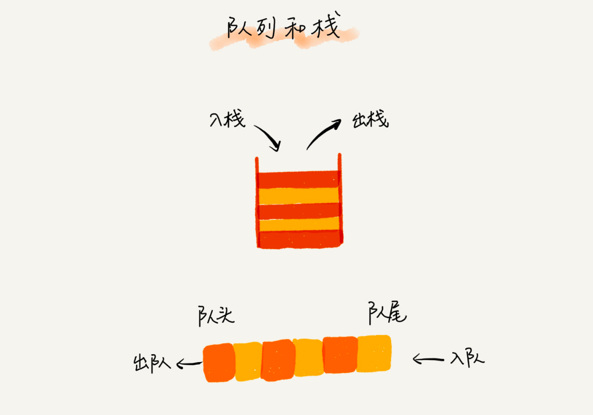
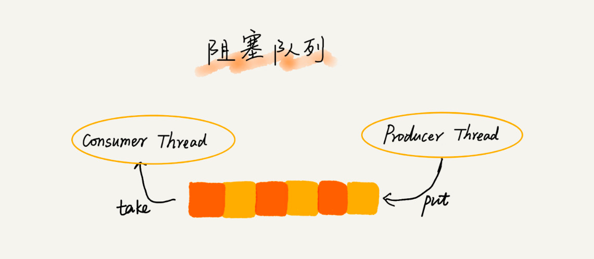
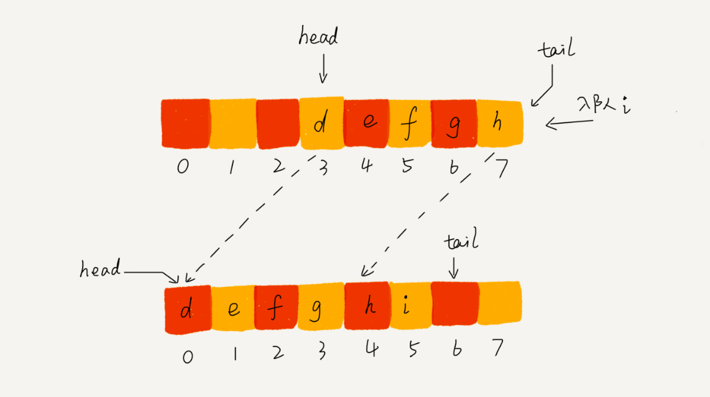
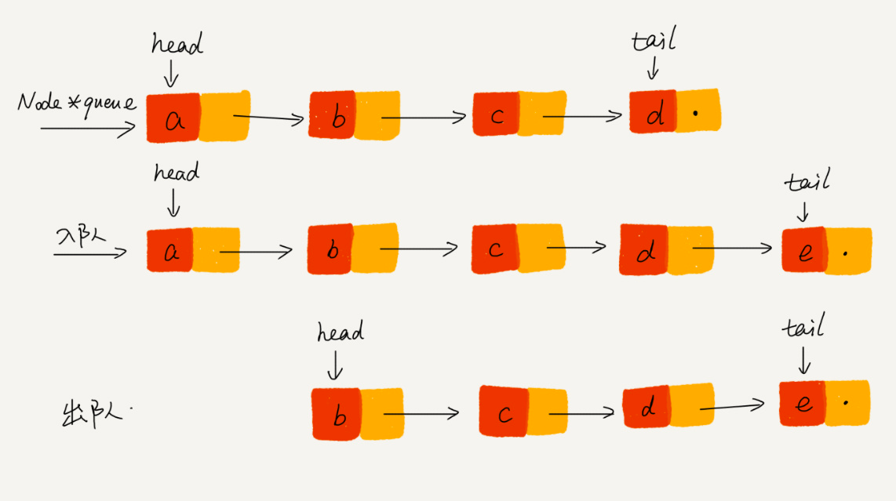

# 队列(queue)
队列和栈类似，也是一种特殊的线性表。和栈不同的是，队列只允许在表的一端进行插入操作，而在另一端进行删除操作。
先进先出，这就是典型的队列
所以，队列跟栈一样，也是一种操作受限的线性表数据结构。

* 循环队列
* 阻塞队列
  Java concurrent 并发包利用 ArrayBlockingQueue 来实现公平锁等。
  
* 并发队列

JDK 队列 ArrayDeque、ArrayBlockingQueue 使用数组实现、LinkedBlockingQueue 使用链表实现

队列可以使用数组或链表实现 用数组实现的叫顺序队列，用链表实现的叫链式队列

数组队列

链表队列

基于链表的实现方式，可以实现一个支持无限排队的无界队列（unbounded queue），但是可能会导致过多的请求排队等待，
请求处理的响应时间过长。所以，针对响应时间比较敏感的系统，基于链表实现的无限排队的线程池是不合适的。

而基于数组实现的有界队列（bounded queue），队列的大小有限，所以线程池中排队的请求超过队列大小时，
接下来的请求就会被拒绝，这种方式对响应时间敏感的系统来说，就相对更加合理。不过，设置一个合理的队列大小，
也是非常有讲究的。队列太大导致等待的请求太多，队列太小会导致无法充分利用系统资源、发挥最大性能。

todo 循环队列、阻塞队列、并发队列实现