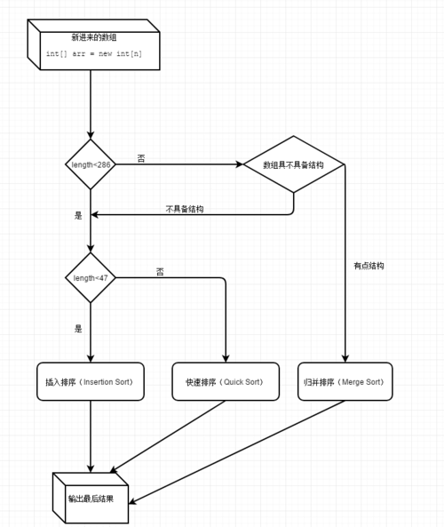

# 排序(sort)

[参考网址](https://mp.weixin.qq.com/s/HQg3BzzQfJXcWyltsgOfCQ)

线性排序
冒泡排序、插入排序、选择排序、 O(n^2)    比较排序算法
归并排序、快速排序、          O(nlogn)  比较排序算法

基数排序、桶排序、计数排序             O(n)

Arrays.sort
阀值QUICKSORT_THRESHOLD（286）小于这个值使用Quicksort （快速排序）
INSERTION_SORT_THRESHOLD（47） 小于这个值使用插入排序
如果count少于MAX_RUN_COUNT（67）的，归并排序

