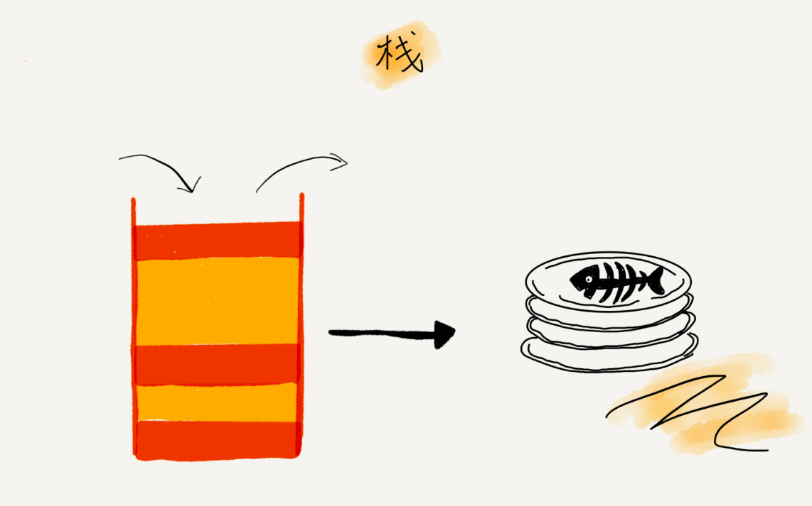
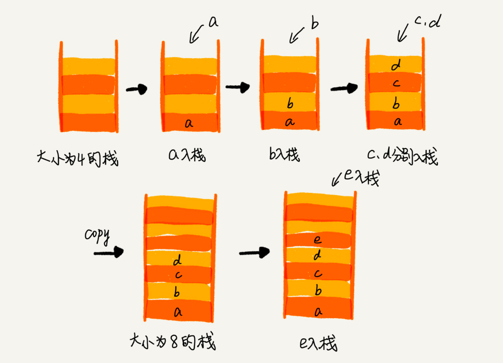
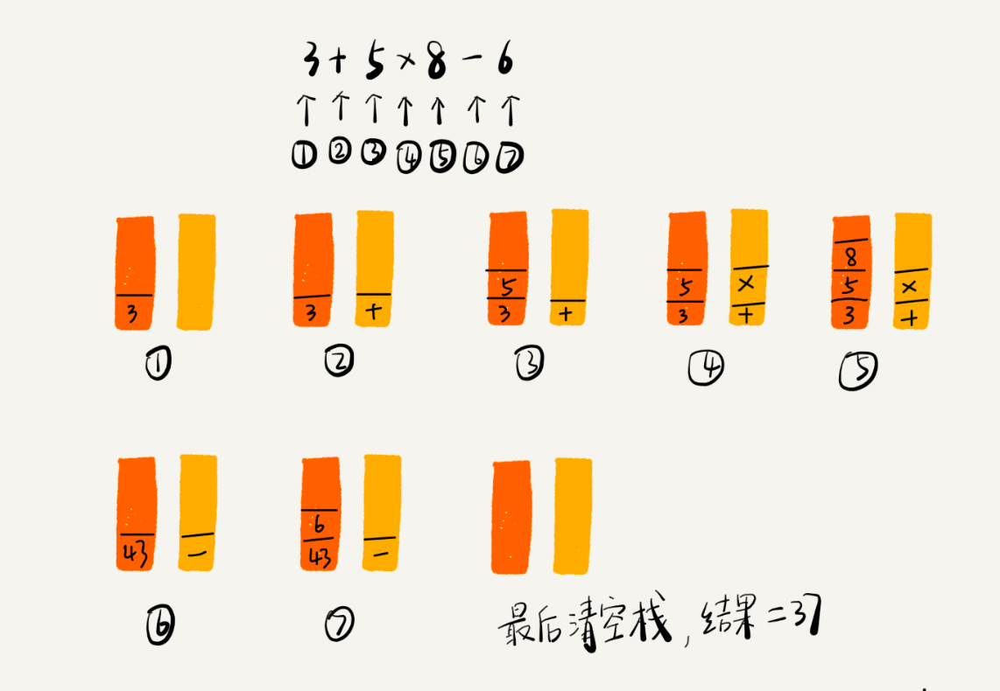

# 栈
栈（Stack）：栈是一种特殊的线性表，它只能在一个表的一个固定端进行数据结点的插入和删除操作。

后进者先出，先进者后出，这就是典型的“栈”结构

从栈的操作特性上来看，栈是一种“操作受限”的线性表，只允许在一端插入和删除数据。

栈既可以用数组来实现，也可以用链表来实现。用数组实现的栈，我们叫作顺序栈，
用链表实现的栈，我们叫作链式栈。

动态扩容栈

编译器就是通过两个栈来实现的。其中一个保存操作数的栈，另一个是保存运算符的栈。
我们从左向右遍历表达式，当遇到数字，我们就直接压入操作数栈；当遇到运算符，就与运算符栈的栈顶元素进行比较。
如果比运算符栈顶元素的优先级高，就将当前运算符压入栈；如果比运算符栈顶元素的优先级低或者相同，
从运算符栈中取栈顶运算符，从操作数栈的栈顶取 2 个操作数，然后进行计算，再把计算完的结果压入操作数栈， 继续比较。

栈在括号匹配中的应用

leetcode上关于栈的题目大家可以先做20,155,232,844,224,682,496.

JDK 栈Stack使用的是数组实现 支持动态扩容

栈可以使用数组或链表实现 用数组实现的叫顺序栈，用链表实现的叫链式栈
